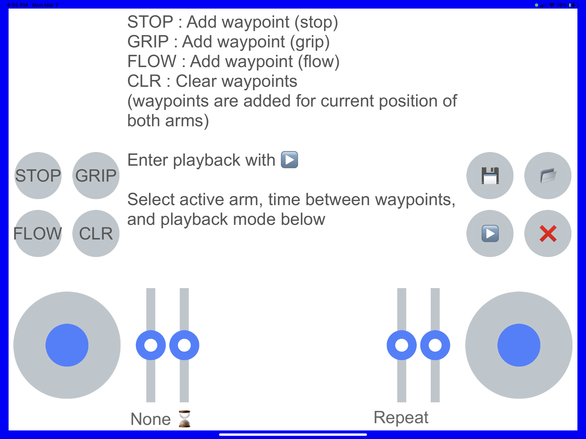
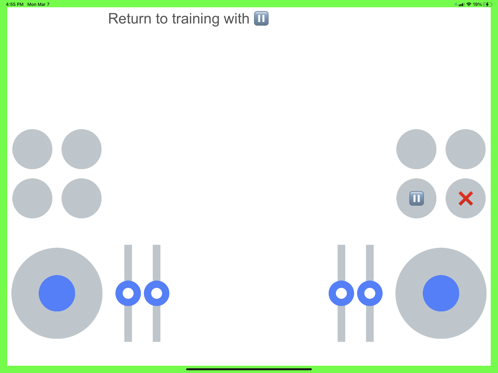
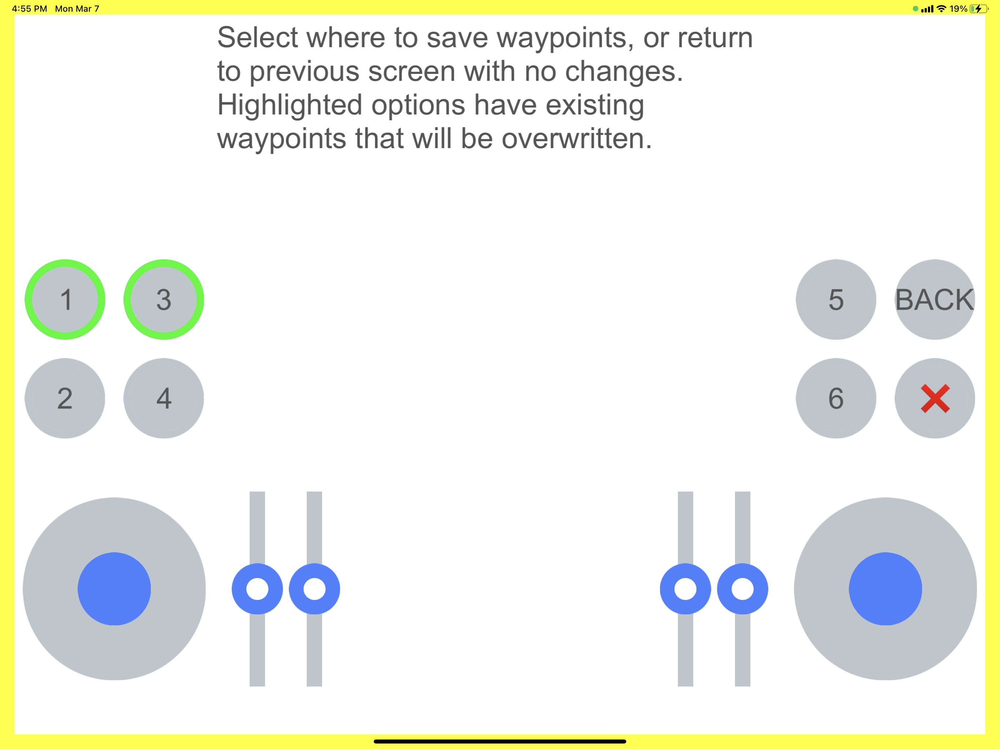
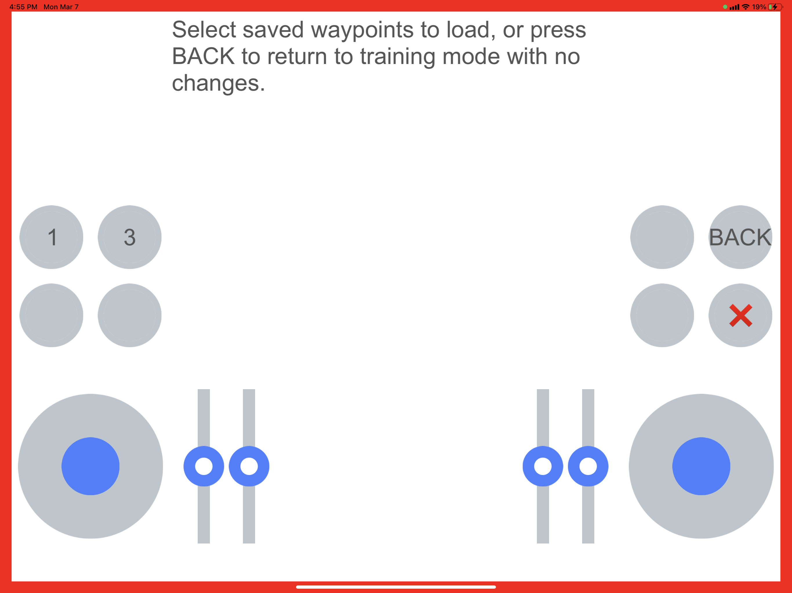

# Arm Examples Documentation

See the main README for instructions to build the examples in this folder.

## Double arm teach-repeat

This example demonstrates a simple teach-repeat with a two-armed robot, using the HEBI Mobile IO iOS/Android app for control.

First, ensure you update the code variables for the HRDF and family name of your system, (default "LeftArm" and "RightArm" with 6-DOF arms) and configure your Mobile IO device with the name and family in the code (defaulting to "Arm" and "mobileIO").

### Training

The main mode when running the demo is the "Training" mode. This allows you to add waypoints, either "STOP" waypoints or "FLOW" waypoints (where the arm moves through the waypoint).  First, move each arm of the robot into position, one at a time.  The slider at the bottom left controls which arm is active; the other is held in place.  The active arm's gripper can be toggled with the "GRIP" button. Once both arms are in position, add the desired type of waypoint.  Continue until all desired waypoints are added.

Note that you can change the time to reach the waypoint you add by adjusting the speed slider (the hourglass) before adding the waypoint.

"CLR" will clear all waypoints that have been added.

### Playback

While in training mode, move the slider at the bottom right to "Single" or "Repeat", depending on if you wish for the motion to be replayed on repeat or not.  Press the "Play" button to enter playback mode.

When finished, press "Pause" to return to training mode.

### Save/Load

From the training screen, you can press the save (disk icon) or load (folder icon) buttons to store the current waypoints or load previously stored waypoints.  The waypoints are stored on the PC, not the mobile IO device.

When saving, a green circle will surround files that already exist on the system to alert you that saving here will overwrite the previous files.

When loading, only available waypoint files will be shown as options.

### Quitting

From any mode, press the red "X" at the right side of the Mobile IO device.  
